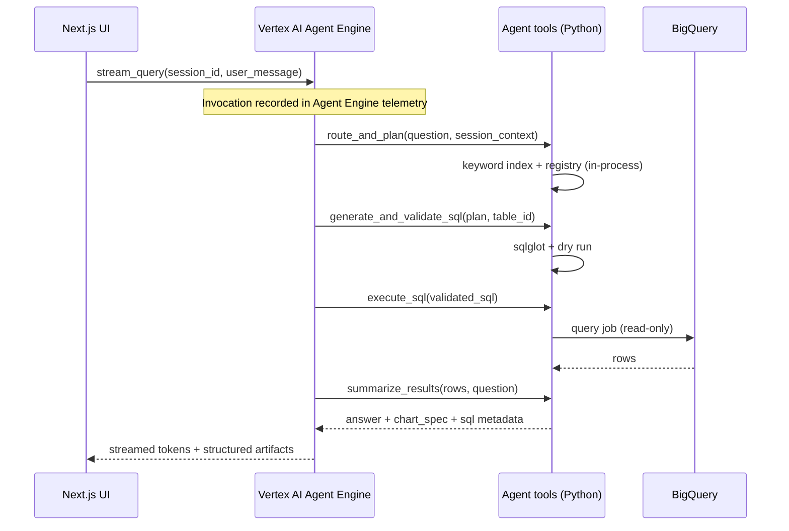

# Agent Engine–only architecture (Jaybel)

**Requirement:** Every UI interaction is an **Agent Engine invocation** so telemetry appears in the Vertex AI Agent Engine dashboard.

## Request flow

## Component responsibilities

| Component | Role |
|-----------|------|
| **Next.js UI** | Firebase **Google Sign-In** (`jaybel-dev`); runs at **`http://localhost:3000`** in v1; session sidebar; **only** calls Agent Engine APIs for chat |
| **Agent Engine agent** | Orchestrator LLM + tool routing; owns user-visible conversation |
| **Agent tools package** | Implements L1–L5: registry load, routing, SQL gen, validation, BQ execute, answer — bundled with agent deployment |
| **FastAPI (optional)** | **Not** on query hot path. May host: health, admin reload registry, PDF export, session APIs if not in Firestore client |
| **Schema registry** | `schema_registry/tables/*.yaml` + `join_allowlist.yaml` baked into agent container |
| **BigQuery** | `jaybel-dev.jaybel_sales_analytics.*` |

## Why tools live in the agent package

Agent Engine–only entry means the **orchestrator and tools deploy together** to the reasoning engine. Cloud Run tool callbacks are optional for v2; v1 keeps all pipeline steps inside the deployed agent artifact so every step is still one Agent Engine invocation tree.

## Service account

Runtime identity: `115724636423-compute@developer.gserviceaccount.com` (confirm Agent Engine deployment uses this SA or a dedicated one with same roles).

## Streaming contract (UI)

The UI does **not** call FastAPI for queries in v1. Map Agent Engine streaming payloads to these UI event types (same shapes as the plan’s SSE contract):

| UI state | Source |
|----------|--------|
| Status text | Tool progress / agent thinking |
| Table name | `route_and_plan` result |
| SQL accordion | Post-validation SQL |
| Data table | Query rows JSON |
| Answer tokens | Final summarization stream |
| Chart | Parsed `chart_spec` |
| Done / error | Terminal events |

## Display name (console)

`Jaybel Sales Analytics Agent` — see `agent/.agent_engine_config.json`.

## Local development (v1)

| Item | Value |
|------|--------|
| UI URL | `http://localhost:3000` |
| Auth | Firebase Google; add `localhost` to authorized domains |
| Config | `frontend/.env.local` (created in implementation) |
| Decisions | `docs/DECISIONS.md` |
