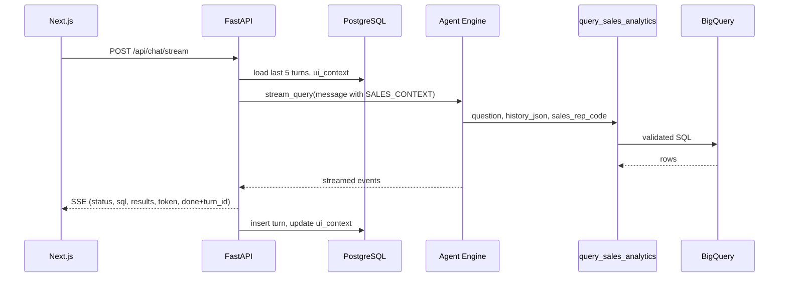

# Agent Engine architecture (Jaybel)

**Requirement:** Every analytics question is an **Agent Engine invocation** (Vertex AI dashboard telemetry).

**Local app (v1):** Next.js → **FastAPI** → Agent Engine. Sessions and turns in **PostgreSQL**.

## Request flow



## Tool: `query_sales_analytics`

| Input | Source |
|-------|--------|
| `question` | Full user message (may include `[SALES_CONTEXT]...[/SALES_CONTEXT]` prefix) |
| `history_json` | JSON array of prior turns (also inside envelope) |
| `sales_rep_code` | Postgres user profile |
| `user_id` | Default dev user |

Agent parses `[SALES_CONTEXT]`, strips it from the question, and calls `Pipeline.run(history=...)`.

## Component responsibilities

| Component | Role |
|-----------|------|
| **Next.js** | Chat UI, explore drawer, follow-ups, feedback — **no Firebase** |
| **FastAPI** | Sessions, catalog API, SSE proxy, persist turns |
| **PostgreSQL** | App state only |
| **Agent Engine** | Orchestrator + pipeline tool |
| **BigQuery** | Warehouse |

## Display name

**Sales and analytics agent**

## Engine resource

- ID: `8991351443894042624`
- File: `agent/AGENT_ENGINE_RESOURCE.env`

## Deploy / redeploy

```bash
./scripts/deploy-sales-agent-engine.sh --agent-engine-id 8991351443894042624
```

Redeploy after changes to `agent/sales_analytics_agent/agent.py` or bundled `pipeline/`.

## Streaming contract (UI)

| Event | UI use |
|-------|--------|
| `status` | Pipeline status line |
| `table_name` | Table label |
| `sql` | SQL accordion |
| `results` | Data table |
| `token` | Streaming answer |
| `chart_spec` | Recharts panel |
| `cost_warning` | Bytes scanned banner |
| `done` | Finish; includes `turn_id`, `query_id` |
| `error` | Error message |

## Local development

| Item | Value |
|------|--------|
| UI | http://localhost:3000/chat |
| API | http://localhost:8000 |
| Postgres | `./scripts/start-phase-c.sh` (port **15433**) |
| Auth | `gcloud auth application-default login` |

See `docs/ARCHITECTURE_LOCAL.md`, `docs/PHASE_C_LOCAL.md`.
