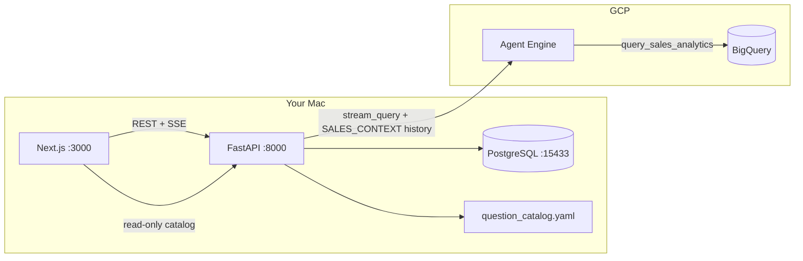

# Local app architecture (Phase C) — corrected

This document replaces the earlier assumption that **Firebase + Firestore** would store app data.  
Your requirement: **run everything on your Mac for now**, with **local PostgreSQL** for application data.

---

## What did NOT change

| Layer | Still true |
|-------|------------|
| **Sales analytics data** | **Google BigQuery** (`jaybel-dev.jaybel_sales_analytics`) |
| **NL → SQL pipeline** | Phase A `pipeline/` (route, SQL, validate, execute BQ, answer) |
| **Query entry (telemetry)** | **Vertex AI Agent Engine** — each question = `stream_query` |
| **Timezone** | `Australia/Sydney` |
| **Agent Engine ID** | `8991351443894042624` |

Analytics are **not** in Postgres. Postgres holds **app state** and **UI metadata** only.

---

## What changed

| Before | Now |
|--------|-----|
| Firebase Google Sign-In | **Local dev user** in Postgres |
| Firestore for sessions | **PostgreSQL** — sessions, turns, `ui_context`, feedback |
| UI only free-text | **Question catalog** — categories, starters, follow-ups (`content/question_catalog.yaml`) |

---

## Runtime diagram



### Per message flow

1. User submits question (or picks starter → fills input → Send).
2. UI opens SSE to `POST /api/chat/stream` with optional `starter_id` / `category_id`.
3. FastAPI loads last **5** turns from Postgres → builds `[SALES_CONTEXT]` envelope.
4. FastAPI calls Agent Engine `stream_query`.
5. Agent tool runs pipeline with `history` → BigQuery → streams events (`chart_spec` from `chart_selector`, markdown from L5).
6. FastAPI forwards SSE to browser; on completion persists turn and emits `done` with `turn_id`.
7. UI loads **follow-up chips** via `POST /api/question-catalog/follow-ups` (uses turn + `ui_context`).

---

## PostgreSQL

| Table | Purpose |
|-------|---------|
| `users` | Dev user; `sales_rep_code` for rep-scoped questions |
| `chat_sessions` | Sidebar; `agent_engine_session_id`; `ui_context` (`last_starter_id`, `last_category_id`) |
| `chat_turns` | Full turn payload + `starter_id` / `category_id` + optional feedback |

Migrations: `sql/migrations/001` through `004`.

---

## Question catalog (read-only, repo file)

- Path: `content/question_catalog.yaml` (config: `config/jaybel.yaml` → `ui.question_catalog_path`)
- Build: `scripts/build_question_catalog.py` (from `docs/qa_evaluation_set.yaml`)
- Served by FastAPI — **not** stored in Postgres (except turn-level `starter_id` / `category_id`)

---

## Pipeline extensions (v1.2 / v1.3)

| Module | Role |
|--------|------|
| `pipeline/analytics_context.py` | Injects target/run-rate/pattern archetypes into L1/L2/L5 |
| `pipeline/chart_selector.py` | Rule-based chart type after L4 (not L5 JSON) |
| `config/sales_targets.yaml` | FY targets compared to BQ actuals in SQL |

---

## Local services

```bash
./scripts/start-phase-c.sh
PYTHONPATH=. .venv/bin/uvicorn backend.main:app --reload --port 8000
cd frontend && npm run dev
```

Open **http://localhost:3000/chat**

---

## Environment

| File | Purpose |
|------|---------|
| `backend/.env` | `DATABASE_URL`, `AGENT_ENGINE_RESOURCE` |
| `frontend/.env.local` | `NEXT_PUBLIC_API_BASE_URL=http://localhost:8000` |

UI should call **only** FastAPI (not Agent Engine directly).

---

## Deferred

- Firebase, Firestore, Redis, server PDF/GCS, Memory Bank, cloud hosting
- UI-4: LLM follow-ups, command palette, mobile sheet
