# Jaybel Sales Analytics — Complete Architecture Guide (Beginner Friendly)

**Purpose of this document:** If you read only one file, read this one. It explains what the project does, how every piece connects, and what happens from the moment a user types a question until they see an answer and chart.

**Audience:** New developers, analysts, or stakeholders with no prior knowledge of this codebase.

> **How to view diagrams**
> - **PDF (recommended for sharing):** [`PROJECT_ARCHITECTURE_GUIDE.pdf`](PROJECT_ARCHITECTURE_GUIDE.pdf) — full guide with rendered Mermaid diagrams.
> - **In Cursor / VS Code:** Markdown Preview (`Cmd+Shift+V`) — SVG images render in the `.md` file.
> - **In the browser:** [`PROJECT_ARCHITECTURE_GUIDE.html`](PROJECT_ARCHITECTURE_GUIDE.html) — live Mermaid.
> - **Regenerate PDF:** `python scripts/generate_architecture_pdf.py` (requires `npm install` in `scripts/` once).

---

## 1. What is this project? (In plain English)

Imagine a **smart assistant for sales data**. A user asks a question in normal English, for example:

> *"How far behind are we on our Overall Business Target of $6M?"*

The system:

1. **Understands** what they are asking (sales target, not weather).
2. **Picks** the right database tables in Google BigQuery.
3. **Writes** a safe SQL query (not guessed blindly — validated step by step).
4. **Runs** that query on real Jaybel sales data in the cloud.
5. **Explains** the answer in readable text, shows a **table**, and sometimes a **chart**.

The chat **looks** like ChatGPT, but underneath it is a **controlled pipeline** designed to reduce wrong SQL and wrong numbers.

---

## 2. The big picture — two worlds

Your app lives in **two places**:

| Where | What lives there | Think of it as |
|-------|------------------|----------------|
| **Your Mac (local)** | Web UI, API, Postgres, config files | The “app shell” — chat history, buttons, sessions |
| **Google Cloud (GCP)** | Agent Engine, BigQuery, Vertex AI (LLM) | The “brain + warehouse” — analytics and AI |

**Important rule:** Sales numbers are **never** copied into Postgres. Postgres only stores **chat sessions and messages**. All sales figures come from **BigQuery**.

### Diagram — System overview — local Mac and Google Cloud


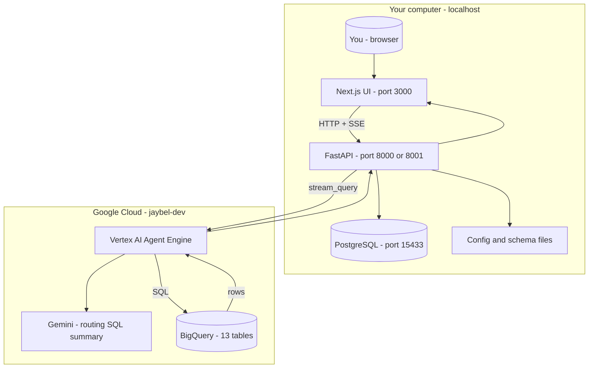

---

## 3. Main components — who does what?

| Component | File / folder | Simple job |
|-----------|---------------|------------|
| **Next.js UI** | `frontend/` | Chat screen, charts, “Browse questions”, sidebar sessions |
| **FastAPI** | `backend/` | Saves chats to Postgres; forwards questions to Agent Engine; streams events back to UI |
| **PostgreSQL** | `sql/migrations/`, Docker | Remembers users, sessions, each Q&A turn, thumbs up/down |
| **Agent Engine** | `agent/sales_analytics_agent/` | Google’s hosted agent; every question is one “invocation” (visible in GCP console) |
| **Pipeline** | `pipeline/` | The real work: route → SQL → validate → run BQ → answer → chart |
| **Schema registry** | `schema_registry/tables/*.yaml` | Describes all 13 BigQuery tables, columns, example SQL |
| **Config** | `config/` | GCP project, targets ($6M goal), account patterns, etc. |
| **Question catalog** | `content/question_catalog.yaml` | 97 starter questions + categories for the UI |

The UI **never** talks to BigQuery directly. It only talks to **FastAPI**. FastAPI talks to **Agent Engine**. Agent Engine runs the **pipeline tool**, which talks to **BigQuery**.

---

## 4. End-to-end journey — one question from click to chart

This is the **full path** for a single message.

### Diagram — End-to-end request flow (one question)

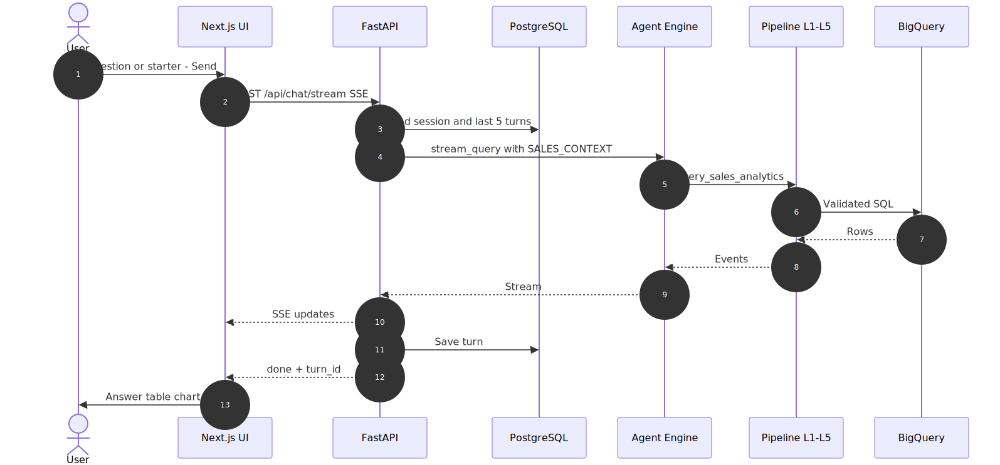

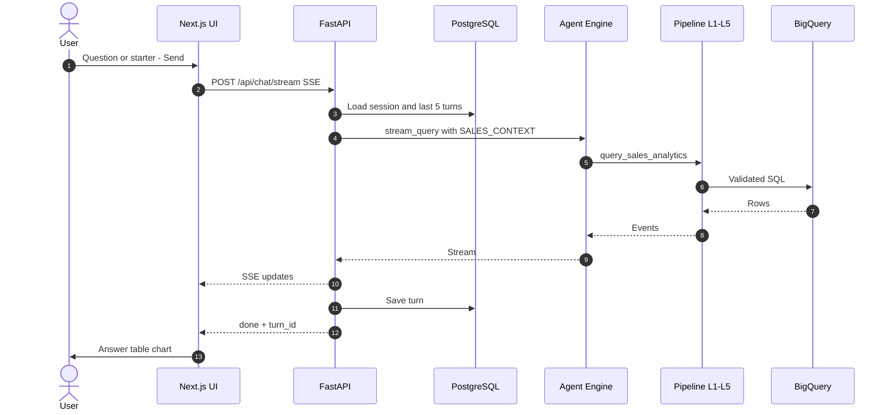

### Step-by-step (no jargon version)

1. **You send a message** in the chat at `http://localhost:3000/chat`.
2. **The browser** opens a streaming connection (`SSE`) to FastAPI: `POST /api/chat/stream`.
3. **FastAPI** loads your chat session from Postgres and the **last 5 previous Q&A turns** so follow-ups like *“now only for Furniture”* have context.
4. **FastAPI** calls **Vertex AI Agent Engine** with your question plus that history (inside a `[SALES_CONTEXT]...[/SALES_CONTEXT]` block).
5. **Agent Engine** calls the tool **`query_sales_analytics`**, which runs the **pipeline** on Google’s side (same Python code you have in `pipeline/`).
6. The **pipeline** produces events: “Analyzing…”, then SQL, then table rows, then answer words one-by-one, then chart type.
7. **FastAPI** forwards each event to the browser as it arrives (you see status updates and streaming text).
8. When finished, **FastAPI saves the turn** in Postgres and sends a final `done` event with `turn_id`.
9. **The UI** renders markdown sections, the data table, KPI cards, and Recharts chart.

---

## 5. The pipeline (L1 → L5) — the core engine

Everything analytical happens inside **`pipeline/pipeline.py`**. Think of it as an **assembly line** with five stations.

### Diagram — Pipeline L1 through L5


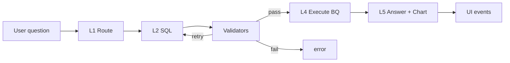

### L1 — Intent Router (`pipeline/intent_router.py`)

**Question answered:** *“What kind of question is this, and which BigQuery table is the main one?”*

- Uses **keyword index** (fast, no AI) and/or **Vertex LLM** for harder cases.
- Output includes: `table_id`, `intent` (trend, ranking, comparison, …), `join_pattern`, time range.
- **v1.2:** `pipeline/analytics_context.py` adds hints for targets, run-rate, closed accounts, embroidery.

### L2 — SQL Generator (`pipeline/sql_generator.py`)

**Question answered:** *“What exact SQL should we run?”*

- Reads the chosen table’s YAML from **schema registry** (columns, examples).
- Only allows **joins** listed in `schema_registry/join_allowlist.yaml`.
- Injects **Australia/Sydney** date logic when the user says “last month”, “FY 2025-2026”, etc.
- Can use **config targets** (e.g. compare sales to $6,067,292.04 from `config/sales_targets.yaml`).

### Validators (`pipeline/validators/`)

**Question answered:** *“Is this SQL safe and correct before we spend money running it?”*

| Validator | What it checks |
|-----------|----------------|
| Column check | Every column exists on allowed tables |
| Safety check | No `DELETE`, `DROP`, only allowed tables |
| Dry run | BigQuery estimates the query (bytes scanned) |

If validation fails once, L2 gets **one retry** with the error message. If it still fails, the user sees an error event.

### L4 — Execute (`pipeline/bq_executor.py`)

**Question answered:** *“Run the SQL and get rows.”*

- Executes against `jaybel-dev.jaybel_sales_analytics`.
- Returns rows, column names, row count (capped for UI).

### L5 — Answer + Chart (`pipeline/answer_generator.py`, `pipeline/chart_selector.py`)

**Question answered:** *“How do we explain this to a human, and what chart fits?”*

- **L5 (LLM):** Writes markdown with sections: Summary, Key figures, Notes, Caveats.
- **chart_selector (rules, not LLM):** Picks line, bar, pie, paired (Actual vs Target), or grouped bar from data shape + intent.
- Words stream to the UI as `token` events; chart arrives as `chart_spec`.

---

## 6. Where does data live?

### Diagram — Where data lives — BigQuery, Postgres, repo files


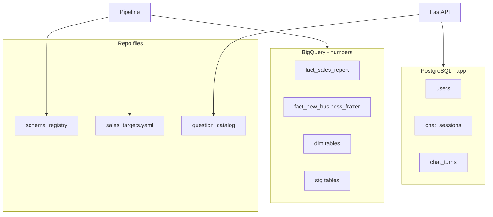

### BigQuery — 13 tables (analytics)

| Type | Examples | Used for |
|------|----------|----------|
| **Facts** | `fact_sales_report`, `fact_new_business_frazer` | Sales, GP, quantities — most questions |
| **Dimensions** | `dim_sales_customer`, `dim_product`, `dim_date`, … | Names, categories, dates |
| **Staging** | `stg_sales_report`, `stg_total_working_days`, … | Raw/source views, working-day KPIs |

Grain and column meanings are documented in each **`schema_registry/tables/<table>.yaml`** file.

### PostgreSQL — 4 migrations (app only)

| Table | Stores |
|-------|--------|
| `users` | Dev user email, optional `sales_rep_code` for “my performance” questions |
| `chat_sessions` | Sidebar chats, link to Agent Engine session id, last starter/category |
| `chat_turns` | Each question, SQL, answer text, sample rows, chart JSON, feedback |

### Repo config (not in BigQuery)

| File | Why it exists |
|------|----------------|
| `config/sales_targets.yaml` | FY goals ($6M overall, Furniture GP, BTS) — compared to actuals in SQL |
| `config/account_patterns.yaml` | Detect “closed” accounts by name pattern |
| `config/embroidery_patterns.yaml` | Find embroidery / custom print lines |
| `config/jaybel.yaml` | GCP project, dataset, fiscal rules, limits |

---

## 7. Schema registry — how the agent “knows” your tables

Before any question runs, the pipeline loads **YAML files** that describe BigQuery.

Each file includes:

- Table name and business description  
- Every column with type and meaning  
- **Few-shot examples** (question → correct SQL)  
- Tags for keyword search (“sales”, “customer”, “working days”)

**Loader:** `pipeline/registry/loader.py`  
**Keyword search:** `pipeline/registry/keyword_index.py`  
**Allowed joins:** `pipeline/registry/join_allowlist.py`

This design **reduces hallucination**: the model is grounded in real column names and approved join paths.

---

## 8. Agent Engine — why it sits in the middle

Google **Vertex AI Agent Engine** is a hosted runtime for agents.

**Why Jaybel uses it:**

- Every user question = one **logged invocation** in GCP (operations/telemetry).
- The **same pipeline code** is bundled inside the deployed agent.
- The local FastAPI app does **not** re-implement analytics; it **proxies** to Agent Engine.

### Diagram — Agent Engine in the request path


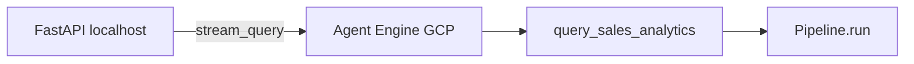

**Deploy / update after code changes:**

```bash
./scripts/deploy-sales-agent-engine.sh --agent-engine-id 8991351443894042624
```

Resource details: `agent/AGENT_ENGINE_RESOURCE.env`

---

## 9. Question discovery UI — how users find questions

Not everyone knows what to ask. The UI helps them browse.

### Diagram — Question discovery UI flow


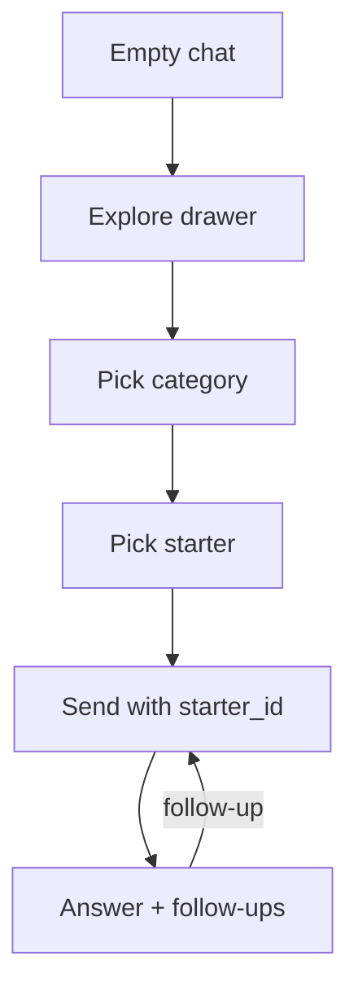

| Piece | Location |
|-------|----------|
| Categories & starters | `content/question_catalog.yaml` |
| Built from QA set | `scripts/build_question_catalog.py` ← `docs/qa_evaluation_set.yaml` |
| API | `GET /api/question-catalog/categories`, `.../starters`, `POST .../follow-ups` |
| UI components | `frontend/components/explore/` |

**Badges** on starters show data availability: full, config target, run-rate estimate, rep code required, etc.

---

## 10. What the user sees — UI building blocks

### Diagram — Chat page UI layout


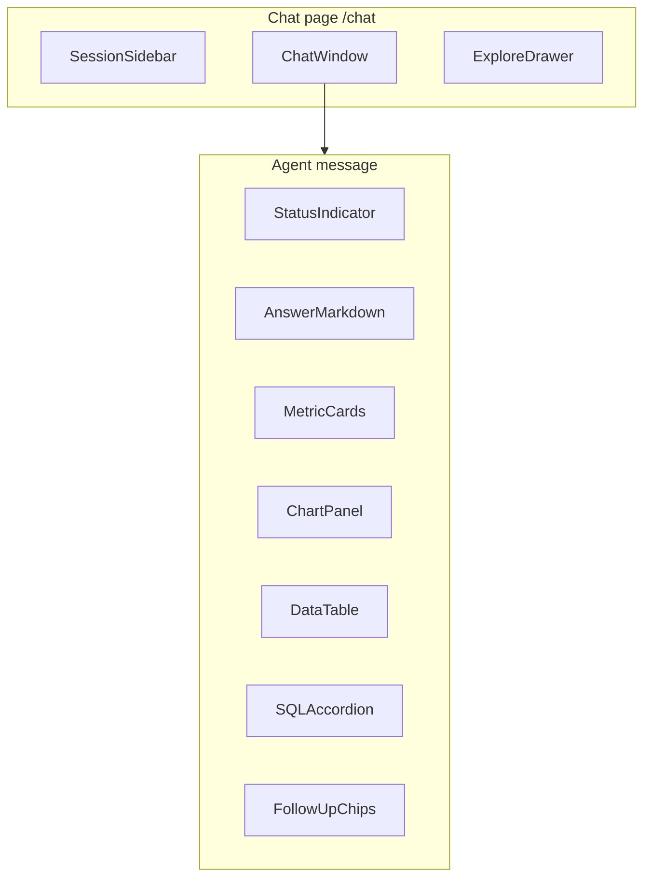

**Streaming behavior:** While the answer is generating, you see plain streaming text. When `done` arrives, the same content re-renders as **formatted markdown** with charts and table.

---

## 11. Streaming events — the contract between pipeline and UI

Every step emits a small JSON object. FastAPI forwards them over SSE.

| Event type | Meaning | UI shows |
|------------|---------|----------|
| `status` | Pipeline step message | “Analyzing your question…” |
| `table_name` | Routed table | Source table label |
| `sql` | Final SQL | Expandable SQL block |
| `results` | Rows from BigQuery | Data table |
| `token` | Piece of answer text | Streaming paragraph |
| `chart_spec` | Chart type + axes | Bar / line / pie chart |
| `cost_warning` | Large query bytes | Warning banner |
| `done` | Finished | Stop spinner; save turn_id |
| `error` | Something failed | Error message |

Defined in: `pipeline/events.py`  
Consumed in: `frontend/hooks/useChatStream.ts`, `frontend/components/chat/AgentMessage.tsx`

---

## 12. Special cases (v1.2 / v1.3)

| Feature | How it works |
|---------|----------------|
| **FY targets ($6M, etc.)** | Target numbers in `config/sales_targets.yaml`; SQL compares BQ **actuals** to those literals |
| **Run-rate projection** | Uses `stg_total_working_days` — estimate, **not** exact Power BI forecast |
| **Closed / embroidery** | Pattern lists in config; SQL uses `LIKE` on names/descriptions |
| **Rep-scoped “my sales”** | User sets `sales_rep_code` in sidebar → passed into pipeline |
| **Charts** | `chart_selector.py` rules — not the LLM guessing chart JSON |
| **Markdown sections** | L5 prompt + fallback normalizer in `answer_generator.py` |

---

## 13. Repository map — where to look in code

```
sales and analytics project/
├── frontend/          → Next.js UI (what users see)
├── backend/           → FastAPI (sessions, chat proxy, catalog API)
├── pipeline/          → L1–L5 brain (also deployed inside Agent Engine)
├── agent/             → Agent Engine wrapper + deploy config
├── schema_registry/   → 13 table YAMLs + join rules
├── config/            → jaybel.yaml, targets, patterns
├── content/           → question_catalog.yaml (UI starters)
├── docs/              → all documentation (including this file)
├── sql/migrations/    → Postgres schema
├── scripts/           → start stack, deploy agent, QA, smoke tests
└── tests/             → automated tests
```

---

## 14. Running the full stack locally

```bash
# 1) Database
./scripts/start-phase-c.sh

# 2) GCP auth (needed for Agent Engine + BigQuery)
gcloud auth application-default login

# 3) API (use 8001 if 8000 is busy)
cp backend/.env.example backend/.env
PYTHONPATH=. .venv/bin/uvicorn backend.main:app --reload --port 8001

# 4) UI — must match API port
cp frontend/.env.local.example frontend/.env.local
# Set NEXT_PUBLIC_API_BASE_URL=http://localhost:8001
cd frontend && npm install && npm run dev
```

Open: **http://localhost:3000/chat**

Health check: `./scripts/test_improvements_ui.sh`

---

## 15. Security and safety model (simple)

| Rule | Implementation |
|------|----------------|
| Read-only analytics | SQL validators block writes/destructive ops |
| Table allowlist | Only registry + join_allowlist tables |
| Column allowlist | sqlglot checks column names per table |
| Cost awareness | BigQuery dry-run; warn if scan > 10GB (config) |
| No secrets in UI | Agent Engine and BQ credentials stay server-side |

---

## 16. What is intentionally *not* in v1

| Not included | Alternative today |
|--------------|-------------------|
| Firebase / Firestore | Local Postgres |
| Cloud-hosted UI | localhost only |
| Exact Power BI forecasts | Run-rate estimate + honest caveats |
| Redis cache | Direct BQ each time |
| LLM-generated follow-ups | Rule-based follow-ups from catalog |

---

## 17. Deeper reading (optional)

| Topic | Document |
|-------|----------|
| Full implementation plan | [nl_to_sql_agent_full_plan.md](../nl_to_sql_agent_full_plan.md) |
| Local stack details | [ARCHITECTURE_LOCAL.md](ARCHITECTURE_LOCAL.md) |
| Agent Engine only | [AGENT_ENGINE_ARCHITECTURE.md](AGENT_ENGINE_ARCHITECTURE.md) |
| Run locally | [PHASE_C_LOCAL.md](PHASE_C_LOCAL.md) |
| Charts & answers | [CHART_AND_ANSWER_UX_PLAN.md](CHART_AND_ANSWER_UX_PLAN.md), [ANSWER_FORMAT.md](ANSWER_FORMAT.md) |
| Business terms | [business_glossary.md](business_glossary.md) |
| 97 test questions | [qa_evaluation_set.yaml](qa_evaluation_set.yaml) |
| Locked decisions | [DECISIONS.md](DECISIONS.md) |

---

## 18. One-page mental model

### Diagram — One-page mental model


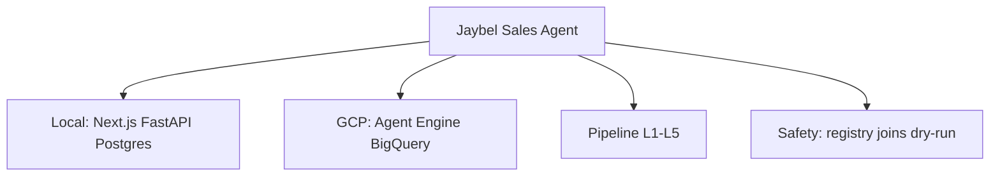

**Remember:** Postgres = **memory of the conversation**. BigQuery = **memory of the business numbers**. The pipeline = **translator** from English to safe SQL and back to human language.

---

*Last updated: 2026-05 — reflects v1 local app, v1.2 Office Supplies targets/patterns, v1.3 charts/markdown answers, Phase D QA.*
