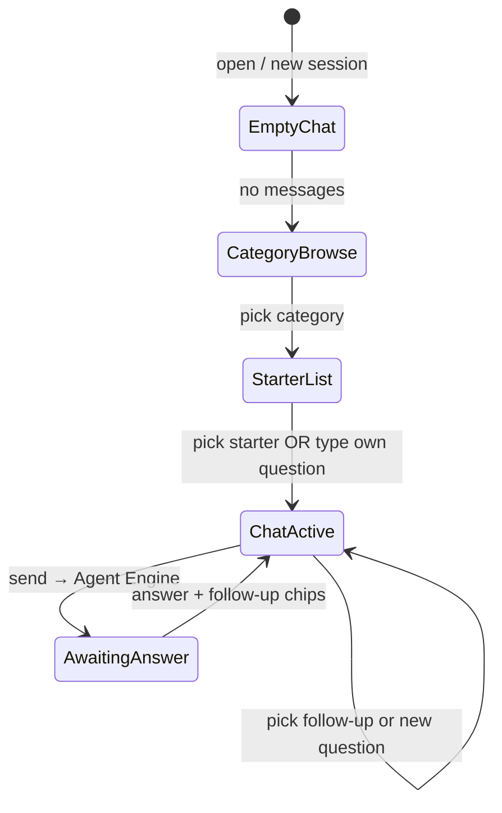
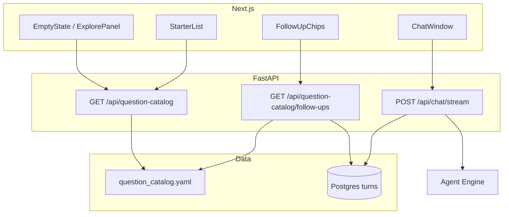

# UI Enhancement Plan — Question Discovery & High-Impact Features

**Status:** Complete (UI-1 through UI-3; v1.2 badges; v1.3 chart/answer UX integrated)  
**Scope:** Phase C+ UI/UX (local Next.js + FastAPI); does not change Agent Engine–only query path  
**Author:** Implementation plan derived from codebase + `docs/qa_evaluation_set.yaml` + `docs/office_supplies_client_questions.md`

---

## Part 1 — Is categories + starters + follow-ups a good idea?

### Verdict: **Yes — with the right implementation split**

| Aspect | Assessment |
|--------|------------|
| **Problem it solves** | Empty chat is intimidating; users don’t know what BigQuery can answer. Your repo already has **97 curated questions** and **9 client categories** — the UI barely exposes them. |
| **Fit for Jaybel** | Sales/BI users think in **domains** (customers, products, reps, targets), not in “SQL tables.” Categories mirror how `office_supplies_client_questions.md` is already organized. |
| **Risk if done wrong** | Static lists that don’t match the last answer feel generic; **target/projection** questions that aren’t in BQ erode trust if presented like normal starters. |
| **Recommendation** | Ship **curated** starters and **rule-based** follow-ups first; optional **LLM-generated** follow-ups only in a later phase. |

### What to avoid

1. **Calling an LLM on every turn** only to suggest “What else?” — adds latency, cost, and inconsistency; fights your validated QA set.
2. **Follow-ups that ignore data limits** — e.g. suggesting “$6M target variance” without a **partial / not in BQ** badge.
3. **Treating follow-ups as new Agent sessions** — follow-up *questions* are fine; follow-up *SQL* must still go through Agent Engine (unchanged).

### Recommended UX model (three layers)



1. **Category browse** (empty state or “Explore questions” panel)  
2. **Starter questions** (6–12 per category, from catalog)  
3. **Follow-up chips** (after each completed answer) — **curated graph** when user picked a catalog question; **rule-based** when user typed free text (use last turn’s `table_id`, `intent`, `category`)

### Critical gap today (must be part of the same program)

**Multi-turn context is weak end-to-end:**

- `pipeline.Pipeline.run()` supports `history`, but `backend/routers/chat.py` does **not** pass prior turns into the agent/tool.
- Agent Engine has its own `agent_engine_session_id`, but the tool receives only the latest `question` string.

**For follow-ups like “Now filter that by Frazer only” (Q031–Q032) to work reliably**, Phase 1 of this plan must include **passing recent turn history** into the tool (or a concise session summary). Otherwise follow-up chips will look smart but answers will disappoint.

---

## Part 2 — High-impact features (prioritized)

Beyond your ask, these are ordered by **user value × feasibility** for this codebase.

| Priority | Feature | Impact | Effort |
|----------|---------|--------|--------|
| **P0** | Question catalog (categories → starters → follow-ups) | Very high | Medium |
| **P0** | Pass session turn history into pipeline (follow-ups actually work) | Very high | Medium |
| **P0** | Data availability badges (`full` / `partial` / `target not in BQ`) on starters | High (trust) | Low |
| **P1** | Redesigned empty state (category cards + search starters) | High | Medium |
| **P1** | Follow-up chips under last agent message (not only empty state) | High | Medium |
| **P1** | “Explore” drawer / tab without losing chat scroll position | Medium | Low |
| **P2** | Starter search + filter by category / table / intent | Medium | Low |
| **P2** | Split view: chart + table sticky panel beside answer | High for analysts | Medium |
| **P2** | Thumbs up/down on turn (store in Postgres, no model fine-tune yet) | Medium | Low |
| **P2** | Session title auto + search past sessions | Medium | Low |
| **P3** | LLM-generated follow-ups (Vertex flash, optional) | Medium | Medium |
| **P3** | Command palette (⌘K) for categories/questions | Nice | Medium |
| **P3** | Mobile-responsive sidebar + bottom sheet categories | Medium | Medium |

**Explicitly deferred (already in master plan):** server PDF/GCS, Firebase auth, Redis cache, moving warehouse to Postgres.

---

## Part 3 — Content model (single source of truth)

### 3.1 New catalog file (recommended)

Create **`content/question_catalog.yaml`** (or `docs/question_catalog.yaml`) — UI-oriented, generated from but not identical to QA YAML.

**Structure:**

```yaml
version: 1
categories:
  - id: executive_kpi
    label: Executive & KPIs
    description: FY totals, GP%, daily averages, YoY
    icon: chart-bar
    order: 1
starters:
  - id: Q061
    category_id: executive_kpi
    text: "What is our total Sales and GP$ for FY 2025-2026 vs last year?"
    data_availability: full
    expected_table_id: fact_sales_report
    intent: comparison
    follow_up_ids: [Q061a, Q061b, Q064]
follow_ups:
  - id: Q061a
    parent_starter_id: Q061
    text: "Break that down by fiscal month"
    intent: trend
  - id: Q061b
    parent_starter_id: Q061
    text: "Show the same comparison for Frazer only"
    intent: comparison
rules:
  - id: after_ranking_customers
    when:
      last_intent: ranking
      last_table_id: fact_sales_report
    suggestions:
      - "What is total GP$ for the top customer?"
      - "Show month-over-month trend for the #1 customer"
```

**Population strategy:**

| Source | Count | Action |
|--------|-------|--------|
| `docs/qa_evaluation_set.yaml` Q061–Q097 | 37 | Already have `category` + `data_availability` — import |
| Q001–Q060 | 60 | **Assign categories** via script (table + intent heuristics) + manual review |
| `docs/office_supplies_client_questions.md` | 37 | Cross-check wording vs Q061–Q097 |
| New follow-up nodes | ~80–120 | Curate 2–4 per high-traffic starter; reuse Q031/Q032 patterns |

**Script:** `scripts/build_question_catalog.py` — reads QA YAML, emits catalog + validation report.

### 3.2 Category taxonomy (proposed v1 — 10 categories)

| `category_id` | Label | Primary tables |
|---------------|-------|----------------|
| `executive_kpi` | Executive & KPIs | `fact_sales_report` |
| `sales_revenue` | Sales & Revenue | `fact_sales_report` |
| `product` | Product & Category | `fact_sales_report` + `dim_product` |
| `customer` | Customers & Accounts | `fact_sales_report` + `dim_sales_customer` |
| `retention` | Customer Retention | `fact_sales_report` |
| `new_business` | New Business (Frazer) | `fact_new_business_frazer` |
| `sales_rep` | My Performance (Rep) | facts + `dim_sales_rep` (needs rep code) |
| `targets` | Targets & Goals | partial — badge required |
| `projections` | Projections & Forecasting | partial |
| `orders` | Orders & Line Items | `fact_sales_report` |
| `time_calendar` | Time & Working Days | `dim_date`, `stg_total_working_days` |

*(Optional 11th `staging_raw` for power users — hidden behind “Advanced”)*

### 3.3 Follow-up generation rules (when no catalog parent match)

| Condition | Example follow-ups |
|-----------|-------------------|
| `intent=ranking` + customers | “GP for top 3”, “Trend for #1 customer” |
| `intent=trend` + time series | “Compare to prior year”, “Break down by territory” |
| `intent=aggregation` + product | “Top 10 within that total”, “Compare Office Supplies vs Furniture” |
| `table_id=dim_*` | “Show fact metrics for that dimension value” |
| `data_availability=requires_target_table` | Only suggest factual alternates: “Show actual Furniture GP$ this year” |

---

## Part 4 — Architecture (fits current stack)



**No new cloud services.** Catalog served from repo file (v1) or loaded at API startup; optional later: store favorites in Postgres.

---

## Part 5 — Implementation phases

### Phase UI-1 — Foundation (P0) — ~3–4 days

**Goal:** Catalog API + history in pipeline + basic browse UI.

| # | Work item |
|---|-----------|
| 1 | Add `content/question_catalog.yaml` + build script from QA set |
| 2 | `backend/services/question_catalog.py` — load, index by category, lookup follow-ups |
| 3 | `backend/routers/question_catalog.py` — `GET /categories`, `GET /categories/{id}/starters`, `GET /follow-ups` |
| 4 | Extend `chat_stream` to load last N turns from Postgres and pass `history` + `user_context` into agent (extend tool or message envelope) |
| 5 | Frontend: `ExplorePanel`, `CategoryGrid`, `StarterQuestionList` |
| 6 | Wire empty `MessageList` → category browse; selecting starter calls `onSend(text)` + stores `starterQuestionId` in React state |
| 7 | `data_availability` badge component on each starter |

### Phase UI-2 — Follow-ups + polish (P1) — ~2–3 days

| # | Work item |
|---|-----------|
| 8 | `FollowUpChips` below last completed `AgentMessage` |
| 9 | API: `GET /follow-ups?session_id=&turn_id=` or `POST` with `{ question, category_id?, starter_id? }` |
| 10 | Rule engine in `question_catalog.py` for free-text questions |
| 11 | Optional: `chat_sessions.ui_context JSONB` migration to persist `last_category_id`, `last_starter_id` across refresh |
| 12 | Starter search (client-side filter on catalog) |

### Phase UI-3 — High-impact extras (P2) — ~2–3 days

| # | Work item |
|---|-----------|
| 13 | Turn feedback `POST /api/sessions/{id}/turns/{turn_id}/feedback` |
| 14 | Session search in sidebar |
| 15 | Split panel for table/chart |
| 16 | Rep category warns if `sales_rep_code` empty |

### Phase UI-4 — Optional (P3)

LLM follow-up suggester, command palette, mobile sheet UI.

---

## Part 6 — Files to create

| File | Purpose |
|------|---------|
| `content/question_catalog.yaml` | Categories, starters, follow-ups, rules |
| `scripts/build_question_catalog.py` | Generate/validate catalog from QA YAML |
| `backend/services/question_catalog.py` | Load catalog, match questions, rule-based follow-ups |
| `backend/routers/question_catalog.py` | REST endpoints |
| `backend/schemas/question_catalog.py` | Pydantic models (or in `schemas.py`) |
| `sql/migrations/003_session_ui_context.sql` | Optional `ui_context JSONB` on `chat_sessions` |
| `sql/migrations/004_turn_feedback.sql` | Optional `rating`, `comment` on `chat_turns` |
| `frontend/lib/questionCatalog.ts` | API client |
| `frontend/types/questionCatalog.ts` | Types |
| `frontend/components/explore/CategoryGrid.tsx` | Category cards |
| `frontend/components/explore/StarterList.tsx` | Questions for category |
| `frontend/components/explore/DataAvailabilityBadge.tsx` | full / partial / target |
| `frontend/components/chat/FollowUpChips.tsx` | Post-answer chips |
| `frontend/components/chat/ExplorePanel.tsx` | Container for empty/active browse |
| `frontend/hooks/useQuestionCatalog.ts` | Fetch categories/starters |
| `frontend/hooks/useFollowUps.ts` | Fetch after turn completes |
| `tests/test_question_catalog.py` | Catalog loader + API tests |
| `tests/test_chat_history.py` | History passed to stream (mocked AE) |
| `docs/UI_QUESTION_DISCOVERY_PLAN.md` | This document |

---

## Part 7 — Files to modify

| File | Changes |
|------|---------|
| `backend/main.py` | Register `question_catalog` router |
| `backend/routers/chat.py` | Load prior turns; build `history` list; pass `starter_id` / `category_id` from request body (optional fields on `ChatStreamRequest`) |
| `backend/schemas.py` | Extend `ChatStreamRequest` with optional `starter_id`, `category_id`; add catalog response models |
| `backend/db/postgres.py` | `get_recent_turns(session_id, limit=5)`; optional `update_session_ui_context` |
| `backend/services/agent_engine.py` | Include history in message to agent or structured state |
| `agent/sales_analytics_agent/agent.py` | Accept `history` / `session_context` on tool; pass to `Pipeline.run(history=...)` |
| `pipeline/pipeline.py` | Ensure history format documented; optional include `category` in L1 prompt |
| `docs/qa_evaluation_set.yaml` | Add `category` to Q001–Q060 (batch edit via script) |
| `docs/PHASE_C_LOCAL.md` | Link to this plan |
| `nl_to_sql_agent_full_plan.md` | Layer 7 UI section update after approval |
| `frontend/components/chat/ChatShell.tsx` | State: `browseMode`, `activeCategory`, `lastStarterId`; integrate Explore + FollowUps |
| `frontend/components/chat/MessageList.tsx` | Render `ExplorePanel` when empty; `FollowUpChips` after last agent msg |
| `frontend/components/chat/ChatWindow.tsx` | Show compact category breadcrumb; “Browse questions” toggle |
| `frontend/components/chat/AgentMessage.tsx` | Slot for follow-ups (or sibling in MessageList) |
| `frontend/lib/api.ts` | Catalog + follow-up endpoints |
| `frontend/types/index.ts` | Shared types or import from `questionCatalog.ts` |
| `config/jaybel.yaml` | Optional `question_catalog_path` |

---

## Part 8 — API contract (v1)

### `GET /api/question-catalog/categories`

Returns ordered list: `{ id, label, description, icon, starter_count }`.

### `GET /api/question-catalog/categories/{category_id}/starters`

Returns starters with `id`, `text`, `data_availability`, `intent`, `badge_label?`.

### `GET /api/question-catalog/follow-ups`

Query params (one of):

- `starter_id=Q061` — curated follow-ups for that starter  
- `session_id` + `turn_id` — use persisted turn metadata + rules  
- `question` (exact or normalized) — fuzzy match to catalog starter  

Response: `{ follow_ups: [{ id, text, data_availability? }], source: "curated" | "rules" }`.

### `POST /api/chat/stream` (extended body)

```json
{
  "session_id": "uuid",
  "question": "string",
  "starter_id": "Q061",
  "category_id": "executive_kpi"
}
```

Backend uses optional ids for logging and follow-up graph; still sends full `question` to Agent Engine.

---

## Part 9 — Agent / pipeline changes (assumptions)

1. **Agent Engine remains the only query path** — catalog endpoints are FastAPI-only (read-only YAML/Postgres).
2. **History format** for L1 (max 5 turns):

   ```json
   [
     { "question": "...", "table_id": "...", "intent": "...", "answer_summary": "..." }
   ]
   ```

   Built from `chat_turns` in Postgres (already stored).

3. **Tool signature extension** (backward compatible):

   ```python
   def query_sales_analytics(
       question: str,
       sales_rep_code: str = "",
       history_json: str = "",  # optional JSON array
       ...
   )
   ```

4. **Redeploy Agent Engine** after `agent.py` change (same as prior user_context update).

5. **Categories for rep-scoped** (`sales_rep`): show banner in UI if `sales_rep_code` not set; still allow questions but label may say “Set rep code in sidebar”.

---

## Part 10 — UX wireframes (behavioral)

### Empty chat

- Hero: “What would you like to explore?”
- Grid of 10 category cards (icon + label + count)
- Link: “Or type your own question below”

### Category selected

- Back button → grid
- List of starter questions (card per question, badge if partial/target)
- Click card → fills input OR sends immediately (product choice: **fill input first** so user can edit)

### After answer

- Normal agent message (status, SQL, table, chart, downloads)
- Row: **Suggested follow-ups** (3–5 chips)
- Chips disappear when user sends next message (or stay grayed for history — product choice: **hide on new send**)

### Sidebar

- Keep sessions + profile
- Add **“Browse questions”** button → opens explore mode in main panel without new session

---

## Part 11 — Risks & mitigations

| Risk | Mitigation |
|------|------------|
| Catalog drifts from QA set | Single build script; CI test counts starters = 97 |
| Too many follow-ups clutter UI | Cap at 5; “Show more” expands |
| Target questions frustrate users | Amber badge + copy: “Target not in BigQuery; we’ll show actuals only” |
| History makes prompts too large | Cap 5 turns; truncate `answer` to 200 chars in history |
| Free-text question doesn’t match catalog | Rule engine only; no false “parent” links |

---

## Part 12 — Success metrics

| Metric | Target |
|--------|--------|
| Empty-state → first question | &lt; 30s median (observe in testing) |
| Starter click-through | Track via `starter_id` on stream body (log in Postgres turn metadata later) |
| Follow-up chip usage | &gt; 20% of completed turns (aspirational) |
| Q031/Q032-style QA cases | Pass with history enabled in integration test |

---

## Part 13 — Approval checklist (confirmed & implemented)

- [x] **10-category taxonomy** (shipped as **11** including `time_calendar`)
- [x] **Curated follow-ups first**, LLM later (Phase UI-4 deferred)
- [x] **Phase UI-1 includes pipeline history** (`[SALES_CONTEXT]` + `history_json`)
- [x] **Starter click**: fill input first
- [x] **`ui_context`** on sessions (write + read for follow-ups)
- [x] **P2**: feedback, split view, session search

**UI-4 (P3) not implemented:** LLM follow-ups, command palette, mobile sheet.
